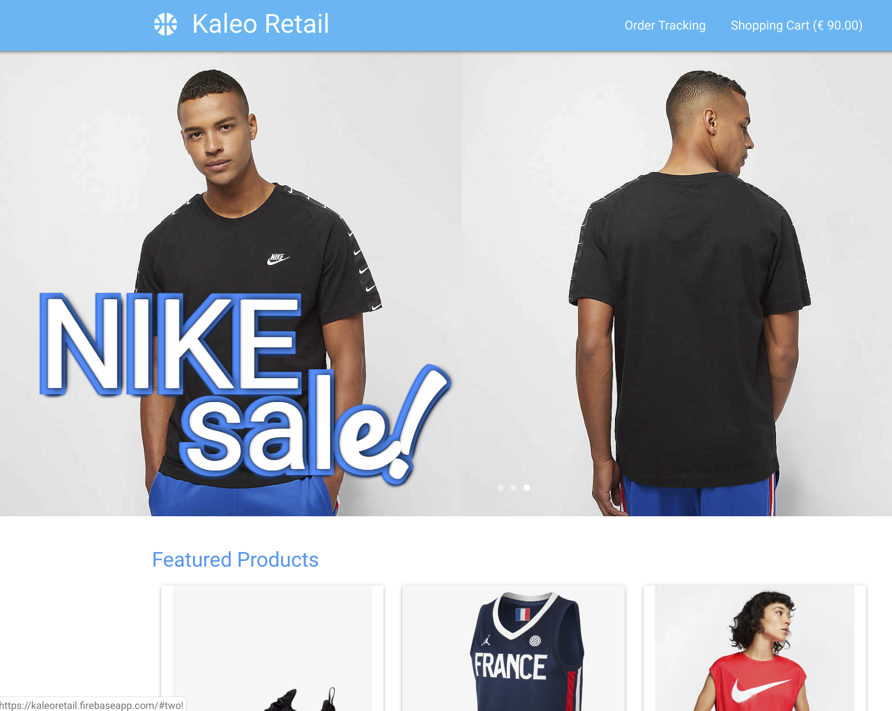
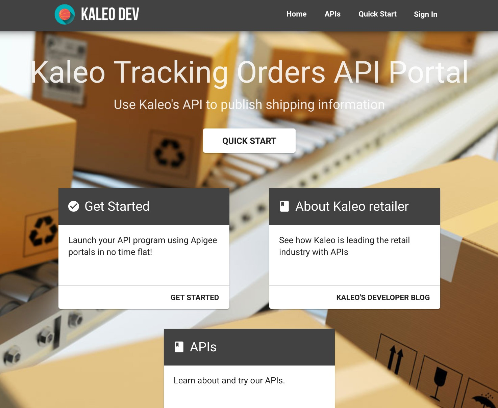
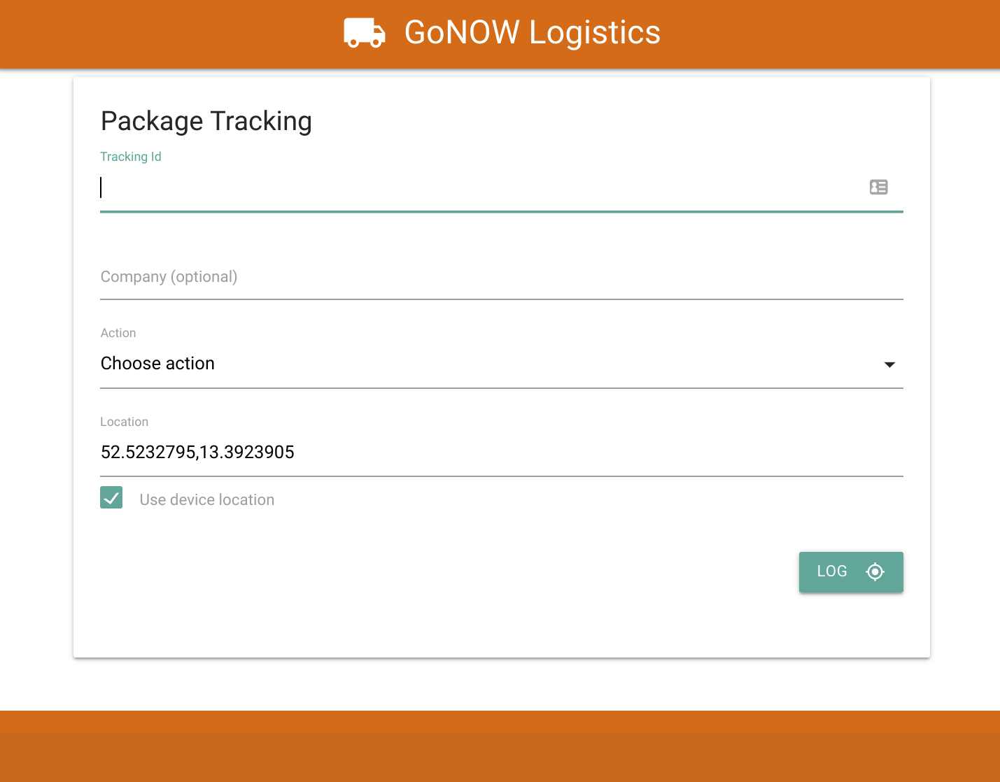

# Kaleo Retail
**Kaleo Retail** leverages **Apigee and Firebase** to create an end-to-end retail integration use-case between a webshop and a logistics delivery partner.

The **Digital Value Chain** in this showcase how integration can be facilitated with open APIs powered by Apigee, a developer portal, and the real-time with a logistic partner's delivery app.  The customer wins because he or she can track their order and delivery in real-time, while the retailer and logistics partner win by enabling easy and self-service integration powered by open APIs.

## Showcase Apps
Kaleo Retail Webshop | Kaleo Developer Portal | GoNOW Logistics App
---------------------|------------------------|---------------------
 |  | 
The Kaleo Retail Webshop is a simple webshop where you can add items your basket, checkout, and track your order in real-time. | The Kaleo Developer Portal is a integration point for logistics providers to both claim packages for delivery, and also update the tracking location. | The GoNOW Logistics app is a sample app that updates the location of a package to Kaleo.

## Cloud Services Used
  

## Demo Guide
**1. Explain the problem:** Integration is on of the most expensive and complicated topics in technology, but the API-First approach makes it simple: publish clean, versioned RESTful APIs for developers to integrate with, and suddenly integration is structured and simple.  This demo shows how a sports retailer, in this case Kaleo Retail, integrates its delivery logistics partners through an API portal and its order and delivery APIs.

**2. Open the Kaleo Retail Webshop:** Add a couple of items to your basket by clicking the basket icon in the Featured Products cards.  

**3. Go to Checkout:** Go to checkout by clicking on the Shopping Cart label at the top-right of the page.  Enter your name, address, and email.  The addres should be somehwere else besides Berlin (since Berlin is the location of Kaleo Retails distribution center).  click NEXT to go to the next step.

**4. Review the order:** Review the order and click SUBMIT.

**5. Watch the Order Tracking:**  Our order was submitted through our Apigee API, and we have the starting location at the distribution center in Berlin shown.  Also a Google Maps window shows the theoretical delivery route to the final destination.

**6. Open the Kaleo Developer Portal:** Open the Kaleo Developer Portal, and show the different APIs documented there, including the order and order tracking APIs, and how these are the interfaces that logistics partners can integrate.

**7. Open the GoNOW Logistics app:** The GoNOW logistics app is a particularly innovative delivery company that updates the package status in real-time through the Kaleo order tracking APIs, so that the customer can see the delivery progress in the Kaleo Webshop.  Both the Webshop and Logistics app should be open side-by-side.  The order tracking id should be automatically filled in the logistics app.

**8. Update the tracking with locations:** Update the package tracking with some different locations (Hannover, Germany for example, or other locations or GPS coordinates).  See how the customer's Order Tracking view updates in real-time with new locations, and how cool this is for customers to see directly in the webshop interface, without having to open another app.  Also close the Order Tracking window, and notice how new updtes show up as messages in the WebShop header, so that the customer knows that there are updates.

## Architecture

Architecture diagram coming soon.

## Deployment

### Backend
After cloning the repository important the proxies into your own Apigee Environment.

### Frontend
After cloning the repository run `npm install` in the frontend directory, followed by `npm run serve` to deploy locally, and `npm run build` to build the web app (built using vuejs) to the dist directory.  

The web apps can also easily be deployed to Firebase by initializing Firebase Hosting for the app, and calling `firebase deploy`.

